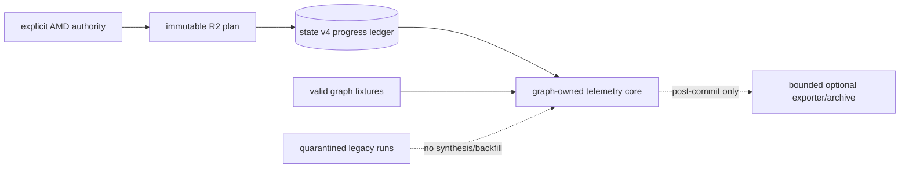
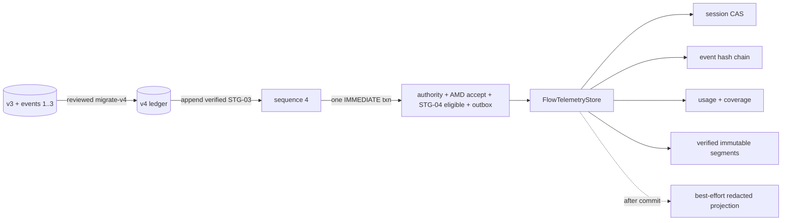

# STG-04 + AMD-0001 architecture slice

State: active after explicit AMD-0001 authority on 2026-09-04. Task root is
`/tmp/agent-collab-stg04.8EFDwI`; this file is the only owned temporary artifact.
Objective: repair the post-v4 progress/amendment bootstrap, accept AMD-0001, then
deliver the complete graph-owned telemetry core without enabling execution.

## Level 1

Verified: production state is v3 and inactive; R2 filesystem evidence has four
events, but the reviewed migrator admits only a chain ending at STG-02. The
operational recovery uses exact source `cf0f1801...` to import events 1..3,
then current code appends the immutable STG-03 event as sequence 4. It never
weakens the migration precondition or edits frozen evidence/schema bytes.

## Level 2

## BDD and deterministic test ledger

- A00: Without separate migration authority no backup/guard/DB write occurs.
  With it, an inactive write-fenced v3 state is migrated using exact reviewed
  source and normative bytes at `cf0f1801...`, importing exactly events 1..3.
  A different commit/manifest or the current four-event package rejects before
  effect. Integrity/FK checks pass, execution stays disabled, and crash/retry
  before sequence 4 leaves a valid recoverable v4 state.
- A01: Given that exact v4 state, appending the immutable STG-03 envelope verifies
  all event JSON/projection columns/start roots/hashes 1..4 and writes sequence 4
  plus outbox atomically. Extra/tampered predecessors or poisoned outbox block;
  full replay is zero-mutation, changed identity/body conflicts, and failpoint
  reopen proves all-or-none.
- A02: AMD schema has exact fields: schemaVersion, amendmentId, ordinal, planId,
  baselinePlanSha256, previousEffectivePlanSha256, affectedStageIds,
  affectedGateIds, reason, reasonSha256, evidence, evidenceSha256, contractDelta,
  acceptanceDelta, authorityDelta, invalidatedEventIds, authorityConsumer,
  authorityReceiptSha256, recordedAt, amendmentSha256. Authority is a separate
  canonical `implementation-amendment-authority/v1` receipt, never embedded in
  the amendment. Its durable canonical preimage is supplied with an out-of-band
  trusted expected SHA-256 by the already-authorized coordinator; neither the
  amendment nor repository files may supply that trust anchor. It contains
  planId, amendmentId, ordinal, consumer, sorted unique affected IDs, the three
  delta hashes, exact no-migration/no-deploy/no-activation/no-launch scope, the
  hash of the user's explicit authorization text and capture time. It never
  contains the final amendment hash. It binds that exact scope to
  `proposalSha256`, computed over the
  amendment without `authorityReceiptSha256` and `amendmentSha256`; the amendment
  then embeds the receipt hash and its normative final hash excludes only
  `amendmentSha256`. Acceptance recomputes both layers, requires arrays already
  sorted and unique, and its event stores the receipt preimage and binds the
  final amendment and authority-receipt hashes, avoiding a circular digest.
  Acceptance verifies every digest/artifact, computes the normative effective
  hash, and writes
  `amendment_accepted` then `step_eligible:STG-04` in one IMMEDIATE transaction.
  Both use the new epoch; STG-08 remains ineligible until STG-04..07 close.
  The positive oracle is the single exact `AMD-0001.json` fixture and digest.
  Its only permitted `contractDelta` is exactly
  `{"STG-04":{"add":["bounded_post_commit_telemetry_export",
  "graph_fixture_event_session_usage_persistence",
  "provider_terminal_usage_normalization_and_observation_transport",
  "terminal_flow_payload_archival"],"deferToStage":{"stageId":"STG-08",
  "capabilities":["graph_transition_and_telemetry_atomicity",
  "runstore_worker_service_cli_telemetry_execution_wiring"]}},"STG-08":
  {"add":["graph_transition_and_telemetry_atomicity",
  "runstore_worker_service_cli_telemetry_execution_wiring"]}}`. Its only
  permitted `acceptanceDelta` replaces the exact original text of STG-04-G1/G2
  with graph-fixture persistence/provider normalization/crash-replay and
  redaction/archive/detached-export/legacy-zero-effect gates, and augments
  STG-08-G1/G2 with transition-plus-telemetry atomicity and no duplicate
  session/event/usage/terminal-receipt clauses. The exact structured text is the
  canonical `AMD-0001.json` positive fixture; no semantically equivalent variant
  is accepted. Its exact authority
  delta is: approval, safety, routing-v5, review quorum and live-call cap
  unchanged; migration, deployment, provider launch, graph activation and legacy
  activation not authorized. Mutation of any stage/gate, owned surface, right or
  authority value rejects before authority consumption, ledger append or outbox.
  A self-consistent forged amendment+receipt pair rejects with zero writes when
  its receipt digest is absent from or differs from the external trusted anchor.
- A03: Same amendment+authority replay is zero-mutation. Reused ordinal/authority,
  changed bytes, stale epoch/chain or missing artifact conflicts with zero writes.
  AMD-0001 emits no invalidation row; a synthetic nonempty amendment proves
  descendants are invalidated transitively, old rows remain immutable, old-epoch
  evidence cannot close changed gates, and checkboxes do not self-restore.
- A04: Post-v4 verification reads SQLite as authority and validates every event,
  effective-plan epoch, amendment and invalidation. Canonical DB tamper/gap/hash
  mismatch fails. Missing/stale JSONL or Markdown remains ledger-verified but is
  reported projection pending/stale; a filesystem-only AMD stays merely proposed.
  DB-backed negative parity controls reject wrong stage/gate, missing or modified
  artifacts, missing/non-PASS Codex auditor or critic, receipt/source mismatch,
  barrier or terminal-oracle mismatch and forged projection PASS exactly as the
  pre-v4 verifier does; none can be hidden by a valid hash chain.
  R2 controls also require an exact optional-lane artifact per PASS: a completed
  optional `changes_requested` or any ambiguous launched attempt blocks; an
  `optional_unavailable` lane is nonblocking and must have no synthetic receipt.
  The first imported R2 event may establish a carried-forward pre-start launch
  baseline with `newLaunchesForStage=null`. An exact legacy allowlist also permits
  null as derived zero only for immutable events
  `r2-stg-00-pass@ca0e9dbd810ab6ed41c8b25c760b71d5bee8c621b60d3895fc778634e63c0bd7`
  and `stg-01-pass@98e901f40784a4b7d2bba23847b80e491f808eb710e14f9ce2fc59f070bb8b97`, and only while
  consumed=40/cap=40 stays identical; frozen artifacts are never rewritten.
  Every event from `stg-02-pass@924887cd4205a7b5b9a9fabad426162d32c3ec6da886eff24b8bc074ba0c5469`
  onward must preserve a monotonic
  consumed count and record an integer stage delta. Only post-start
  deltas count against `IMPLEMENTATION_START.liveProviderScope`; any positive
  delta with unknown cost, cumulative launch overflow, cost overflow, counter
  rollback or silent cap change blocks. The carried-forward count is accounting
  evidence, never authority for a new launch.
- A05: Projector snapshots an exact SQLite watermark after commit. It publishes
  each JSONL/Markdown file independently with temp write, file fsync, rename and
  directory fsync, then rereads and verifies both against that same watermark.
  Only after both verify does a transaction mark outbox rows through the captured
  watermark. A crash between renames leaves the outbox unmarked, and replay
  rebuilds both files from the same SQLite watermark. Symlink/path replacement
  fails closed. An event appended between the snapshot and marking transaction is
  excluded from that watermark and remains unpublished. Projectors acquire one
  exclusive, crash-released `<state-root>/progress-projection.lock`, independent
  of the migration root fence, before snapshot and hold it through both verifies
  and outbox marking while an ordinary DB lease remains open. A controlled W4/W5 two-projector
  interleaving therefore either publishes the newer watermark monotonically or
  leaves rows pending; stale files with a fully published outbox are impossible.
- T01: An FK-valid flow/attempt appends caller-supplied deterministic one-based
  event identities with canonical bytes/hash/genesis. Genesis is exactly
  `sequenceNo=1` and `previousEventSha256=null`; its hash is SHA-256 of the
  exact `FlowEvent/v1` envelope excluding only `eventSha256`: schemaVersion,
  eventId, flowId, sequenceNo, nodeId, attemptId, sessionId, eventType,
  eventVersion, payloadSha256, previousEventSha256, parentSessionId, traceId,
  spanId and createdAt, with nullable values represented as JSON null.
  `parentSessionId` is reconstructed from and must equal the exact
  `TelemetryPayload/v1 {schemaVersion,parentSessionId,data}` wrapper and the
  immutable session parent relation; null/value and mismatch are in the tamper
  oracle. Every STG-04 telemetry event has exactly one bounded payload row at
  append and until verified T08 archival, and event+payload insert atomically.
  Only the archive UoW may remove it, and archived reads must reconstruct the
  identical wrapper bytes. Sequence 0
  rejects; a tamper matrix mutates every envelope field and payload independently.
  The chain remains contiguous under
  two writers, no gap on rollback, exact concurrent replay, identity conflict,
  aggregate overflow rejection and historical tamper detection. Event node,
  attempt and session must form the same causal chain; same-flow wrong-attempt
  linkage rejects.
- T02: Payload acceptance has a safe positive control, accepts exactly 4096 UTF-8
  bytes, rejects 4097, nested credentials/raw reasoning/tool args/results, and
  persists only the bounded redacted projection; invalid append is zero-mutation.
- T03: Session create/run/terminal/orphan CAS enforces exact attempt root binding
  to `graph_node_attempts.session_id`, immutable kind/parent, set-once provider
  ref encoded in `provider_session_ref` as canonical
  `ProviderSessionRef/v1 { value, provenance }`, where provenance is exactly
  `command_pinned | provider_reported`; same-flow acyclic
  ancestry, legal timestamps, one terminal-vs-orphan race winner, unchanged
  replay timestamp, and crash/reopen durability.
- T04: Token fields persist only provider-reported safe integers or NULL; exact
  means all canonical fields known, partial some, unavailable none. Zero is known
  zero. Negative/fractional/NaN/overflow token values reject. USD-to-micro-USD is
  the only allowed derivation and only as a lossless unit conversion: the reported
  `costUsd * 1_000_000` must be a safe integer. Thus `0.0042` becomes `4200`, while
  `0.0000005` stores cost NULL with `unavailable_fractional_microusd` provenance
  and preserves any safe token fields as partial, without rounding. Negative,
  nonfinite or overflow cost and any unsafe token make the whole usage observation
  `invalid_provider_usage`: AgentRunner returns usage unavailable with that code,
  and no `agent_attempt_usage` row or usage-receipt event is persisted. This rule
  also governs mixed safe/invalid fields. A canonical bounded receipt stores the
  six normalized provider fields. Canonical mapping is fixed:
  `inputTokens -> input_tokens`, `outputTokens -> output_tokens`, and losslessly
  converted `costUsd -> cost_microusd`; `cachedInputTokens`, `reasoningTokens` and
  `totalTokens` are validated provider-reported auxiliary evidence preserved in
  the receipt but never added to canonical totals. Completeness depends only on
  the three canonical fields: 3 known is exact, 1-2 partial, 0 unavailable.
  The exact usage receipt hash preimage is the outer
  `TelemetryPayload/v1 {schemaVersion,parentSessionId,data}` wrapper from T01;
  its `data` is `UsageReceipt/v1` with only: schemaVersion, flowId, usageId,
  attemptId, provider, providerSessionId, receiptId, scope, inputTokens,
  cachedInputTokens, outputTokens, reasoningTokens, totalTokens, costUsd,
  costMicroUsd, completeness, provenance, coverageCount, coverageSha256 and
  createdAt. `provenance` has exactly the six provider field keys plus
  costMicroUsd and records provider_reported/unavailable or the exact lossless
  conversion/fractional-unavailable state. The receipt stores each original
  provider value and accepted field provenance in a dedicated
  `attempt_usage_recorded` agent event whose caller-supplied `event_id` equals
  `usage_id` and whose wrapped data contains that identity. The wrapper SHA-256
  must equal both `agent_events.payload_sha256` and
  `agent_attempt_usage.receipt_sha256`. Event header, payload, usage row and
  exact coverage rows commit in one IMMEDIATE transaction; injected failure and
  reopen prove all-or-none. Exact replay revalidates all four table projections,
  not only the digest; reopen and archived-body reads
  reconstruct it. To stay within 4096 bytes, subtree payloads bind only
  `coverageCount` and SHA-256 of canonical sorted covered attempt IDs; exact IDs
  stay in `agent_usage_coverage` and are reverified on read. A self receipt has
  zero coverage rows and logical set `{ownerAttemptId}`; a subtree receipt has
  nonempty descendant-only rows and logical set
  `{ownerAttemptId} union descendants`. Changed provenance
  with identical amounts conflicts. A
  pre-session failure creates no invented provider ID or receipt and is reported
  unavailable.
  A per-field DB tamper matrix covers both wrapper fields, every nested usage key
  and every projected usage/coverage identity, amount, completeness, provenance,
  time and digest.
- T05: Receipt identity/hash replay is idempotent; conflicting body rejects.
  Descendant coverage is same-flow and acyclic. Aggregation deduplicates natural
  receipt identity and identifies attempts with no self receipt. It considers
  subtree receipts owned by those missing-self attempts first, by descending
  logical-set size then lexicographic usage ID, and skips an entire receipt when
  its logical set overlaps a selected subtree. It then adds self receipts only
  for attempts outside selected subtree coverage, so a selected subtree replaces
  every covered descendant self receipt. Thus it is insertion-order invariant,
  counts distinct retry attempts, reports every skipped overlap or uncovered graph
  attempt as partial, and never converts unknown to 0. A hand-calculated
  permutation oracle uses self X=5, self B=1000; subtree A{A,B,C}=30; nested
  B{B,C}=20; D{D,E}=7; C{C,F}=11 and always returns 42 partial: A replaces B's
  self receipt, B is not a missing-self candidate, and C is skipped for overlap.
  A same-size overlap tie is won by the lexicographically smaller usage ID
  regardless of insertion order.
- T06: Codex/Grok/Claude normalizers preserve safe provider session/usage and
  per-field provenance; absent Claude usage is unavailable. Token fields are
  accepted only when provider-reported safe integers. Cost accepts only the
  lossless USD-to-micro-USD conversion defined in T04; fractional micro-USD is a
  field-local unavailable value, while overflow/unsafe values produce the exact
  invalid observation outcome defined in T04. Timeout, malformed terminal and
  pre-session failure have explicit unavailable results. AgentRunner calls the
  Codex and Grok result normalizers with `includeUsage: true` (the command
  builders have no such option) and carries returned provider-neutral
  success/failure session, usage and provenance observations without changing
  routing or authority or converting invalid values to zero.
- T07: Export runs only after durable commit, receives bounded redacted data and
  is never authority. Its asynchronous interface is detached behind a bounded
  invocation deadline: sync throw, async reject and a Promise that never settles
  cannot delay workflow/API completion, hold the transaction or lease, create an
  unhandled rejection, or change the ledger. Best-effort duplicate/loss semantics
  are explicit.
- T07a: Every terminal provider outcome (success, provider failure, timeout or
  malformed terminal response) produces exactly one idempotent
  `AttemptTerminalReceipt/v1` event for its existing graph attempt. The store,
  not the caller, derives event ID as SHA-256 of canonical flowId+attemptId+event
  version. Exact replay adds nothing; a changed body conflicts. Concurrent
  terminal outcomes, including attempts to supply different caller IDs, yield one
  commit and one deterministic conflict without a chain gap. A retry is a distinct
  attempt and thus a distinct terminal receipt; pre-attempt launch failure cannot
  invent one. The hashed event body is the same exact outer
  `TelemetryPayload/v1` wrapper; its `data` is `AttemptTerminalReceipt/v1` with
  only: schemaVersion, flowId, nodeId, attemptId, sessionId, provider,
  attemptOrdinal, outcome, errorClassification, startedAt, terminalAt and usageObservation.
  `usageObservation` has exact status `exact|partial|unavailable|invalid_provider_usage`
  plus nullable usageId. Exact/partial requires a non-null usageId whose row
  matches flow, attempt, provider, session provider reference and completeness.
  `invalid_provider_usage` requires null and no usage row. Unavailable permits
  either a matching non-null unavailable row or null only for the defined
  no-receipt failure path. Identity/timestamps must match the attempt/session
  rows; outcome and error classification must be mutually valid. Null/status,
  same-flow usage swap, outer-wrapper and nested per-field tamper, and body replay
  oracles cover every key and their parent/session relation.
- T08: Archive age is terminal CAS `graph_flows.updated_at`; boundaries are
  90d-1/90d and DB 1GiB-1/1GiB. Eligibility is exactly terminal AND
  (age>=90d OR databaseBytes>=1GiB): terminal old/small and terminal young/large
  qualify; terminal young/small does not; active or reconciling old/large never
  qualifies. The caller supplies one bounded stable `requestId`; `archive_id` is
  derived only from canonical flowId+requestId. `AgentEventArchiveRequest/v1` is
  canonical requestId/flow/range/member-hash input, and its SHA-256 binds the
  immutable request body. Reusing flowId+requestId with a changed range/body
  conflicts; a new requestId may archive a later non-overlapping range, while any
  overlapping range still rejects. The archive identity is the basis of a
  stored relative path
  `telemetry-archives/<sha256(flowId)>/<sha256(archiveId)>.jsonl` beneath a real,
  non-symlink state root; raw caller IDs never enter a path. The immutable
  segment is canonical JSONL ending in LF. Its exact `AgentEventArchive/v1`
  header fields are schemaVersion, archiveId, flowId, requestSha256,
  firstSequence, lastSequence, memberCount, merkleAlgorithm,
  merkleRootSha256 and createdAt. Each following ordered
  `AgentEventArchiveMember/v1` has exactly schemaVersion, flowId, eventId,
  sequenceNo, eventSha256, payloadSha256 and the exact canonical payloadJson
  string; there is one member for every contiguous sequence in the range.
  `archive_sha256` hashes those exact bytes. Merkle leaves are
  SHA-256 of byte `0x00` plus each canonical member line; parents are SHA-256 of
  byte `0x01` plus the left and right 32-byte raw digests, duplicating an odd
  final digest at each level; a single leaf is its own root and empty is invalid.
  Archive-anchor events are never members. A crash-released per-flow filesystem
  lock keyed only by `sha256(flowId)` serializes concurrent
  archivers; exact replay is idempotent and changed range conflicts.
  Segment+directory fsync, exact contiguous membership/root verification and a
  non-member `archive_anchor` event precede payload deletion in a second
  transaction.
  An exact orphan segment may be adopted only when request identity, manifest and
  every hash match. A corrupt/truncated segment, symlink/path replacement, changed
  range or overlap always fails closed with no DB mutation or payload deletion.
  After manifest/anchor commit, a crash is recovered only by rereading and
  revalidating exact segment bytes, header, members, payloads and Merkle root and
  then completing the same idempotent deletion. If that committed archive is
  corrupt, remaining SQLite payloads are never deleted. It is never repaired automatically
  and blocks archived reads, which reverify archive/member/root hashes. After
  payload deletion, event headers/digests, archive manifest, exact membership and
  the non-member archive-anchor event remain queryable and hash-valid.
- T09: Unlinked legacy runs return `legacy_unlinked`, NULL usage and unavailable
  completeness, with zero graph/session/event/usage/archive/export mutations.
- T10: Cross-flow session/event/usage/coverage/archive references fail closed;
  telemetry never creates graph rows, changes graph execution, or activates legacy.
- T11: STG-04 diff and oracle prove RunStore, worker, service and CLI execution
  wiring unchanged. Only valid graph fixtures exercise the core. Transition plus
  telemetry atomicity/crash replay/export isolation remains a mandatory STG-08
  gate and receives no completion credit from STG-04.

Tests: amendment/progress unit + SQLite/CLI seams; `flow-telemetry` pure + SQLite
seams; focused runner normalization tests; migration regression proving the
reviewed three-event import and post-v4 fourth-event append; no live/model E2E.

## SRP ownership

- `src/domain/canonical-json.ts` is the one neutral RFC-8785/SHA-256 adapter used
  by graph, progress, amendment and telemetry code. Existing domain modules
  delegate to it; new scripts and stores never implement their own canonicalizer.
- `src/flow/implementation-amendment.ts` is the pure authority boundary for the
  amendment schema, exact AMD-0001 delta allowlist, proposal/amendment/effective
  hashes and authority-receipt validation. Its only reason to change is the
  amendment contract, never SQLite or filesystem mechanics.
- `src/flow/implementation-progress.ts` is the pure progress-event verifier and
  epoch/invalidation reducer. Its only reason to change is ledger semantics.
- `src/store/implementation-progress-store.ts` is the sole SQLite authority for
  sequence allocation, replay/conflict, amendment consumption, progress outbox,
  projection snapshots and mark-through-watermark SQL. It exposes transaction-
  aware primitives over an issued DB access plus standalone IMMEDIATE wrappers,
  but does not read repository artifacts or publish files.
- `src/app/implementation-progress-service.ts` coordinates independently read
  artifact bytes with the pure verifier and store; it owns no digest rules.
  `src/app/implementation-progress-projector.ts` coordinates store snapshots and
  marking with filesystem-only
  `src/store/implementation-progress-projection-files.ts`; it owns no SQL,
  hashes or stage policy. The existing `.mjs` scripts and CLI are transport-only
  launchers.
  `src/flow/reviewed-v4-source.ts` is pure over injected manifest/tree metadata
  and file bytes and only verifies the pinned STG-03 identity. A transport-only
  script owns Git lookup, isolated-worktree/file I/O and invokes that tree's
  existing `migrate-v4` CLI; there is no second migrator.
- `src/runtime/flow-telemetry.ts` owns pure event/session/usage contracts, safe
  conversion, payload policy and deterministic aggregation. It does not open DB
  or filesystem paths. It is the single owner of `UsageCompleteness` and
  canonical normalized usage; `node-result.ts` imports that contract rather than
  defining a duplicate. Durable event types are named `AgentEventEnvelope` to
  remain distinct from reducer `FlowEvent`. Existing `src/security/redaction.ts`
  remains generic secret-redaction owner; telemetry policy separately rejects
  raw reasoning/tool arguments/results, applies generic redaction and bounds the
  exact projection before hashing.
- `src/store/flow-telemetry-store.ts` is the sole writer of agent session/event,
  payload, usage, coverage and archive tables and the sole owner of session CAS,
  event sequence, causal checks, archive eligibility and DB commit phases. Its
  transaction-aware primitives accept an issued access and can join the STG-08
  outer graph transaction; standalone calls wrap those same primitives in
  IMMEDIATE transactions. Database size is injected as verified BigInt input.
- `src/runtime/flow-telemetry-archive.ts` owns only archive semantics: canonical
  JSONL, Merkle, exact orphan adoption decisions and content verification. It
  receives and returns typed bytes/metadata and delegates confinement, locks,
  writes, rename and every fsync exclusively to `state-file-durability.ts`; it
  cannot decide eligibility or mutate workflow.
  `src/app/flow-telemetry-archive-service.ts` alone coordinates file publication,
  store manifest/anchor commit, file reverification and store deletion commit.
  `src/runtime/flow-telemetry-exporter.ts` owns only bounded detached post-commit
  invocation and can never write canonical state.
- `src/runners/codex.ts`, `grok.ts` and `claude.ts` extract sanitized provider
  facts and retain their existing least-authority command checks. A small pure
  `src/runtime/provider-telemetry.ts` calls the one telemetry usage normalizer and
  maps transport outcomes to provider-neutral observations. AgentRunner retains
  its existing routing/approval/MAP orchestration but only transports this new
  mapped observation; no runner layer persists telemetry or gains graph policy.
- `src/store/state-file-durability.ts` is the shared mechanical adapter for
  confined no-follow paths, hashed lock names, flock ordering, temp writes,
  file/directory fsync and rename. Progress and archive adapters reuse it instead
  of duplicating POSIX durability rules.
- `@opentelemetry/api@1.9.1` is added as the exact optional trace projection API;
  no parallel tracing abstraction is introduced.
- Service-slice matrix: functionality = pure contracts plus the two stores;
  persistence/state transitions/audit evidence = their respective SQLite stores;
  filesystem projection = projector/archive adapters; UI = N/A because no UI is
  introduced; broker/proxy/routing/graph execution = existing owners unchanged
  and compile-time disabled. RunStore, collaboration store, worker, service, MCP
  and CLI execution branches have no STG-04 reason to change.

No source or frozen package mutation begins until BDD critic, BDD auditor and
pre-RED SRP auditor all return PASS on this packet.
